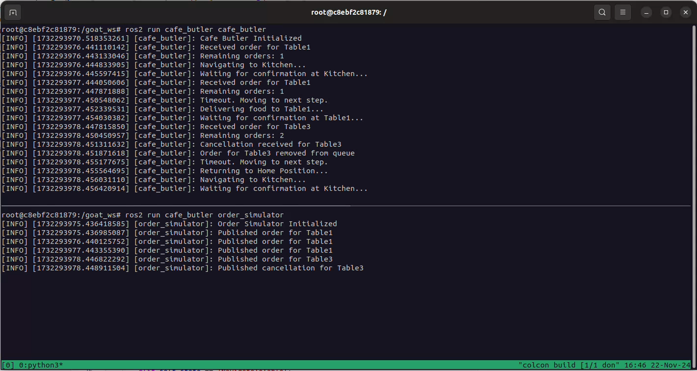

# CAFE ROBOT

Author: Pranava Swaroopa \
License: MIT License \
Package Name: cafe_butler \
ROS Version: ROS-Foxy \
Language: Python \
Environment: Docker \
Status: Under Development

## Problem Statment:
Refer file in the repo: [ROS-Assessment-Task-Goat-Robotics.pdf](ROS-Assessment-Task-Goat-Robotics.pdf)

## Solution:

This project implements a ROS-based robot to handle delivery tasks in a café. The robot receives orders, navigates to the kitchen, delivers food to the specified tables, and handles edge cases, including cancellations, confirmations, and task timeouts.

---

## System Design

### Node Architecture
1. **Order Publisher**:
   - Publishes orders for the robot to process.
   - Simulates cancellations at random.
   
2. **Butler Node**:
   - Manages the robot’s state (`Idle`, `NavigateToKitchen`, `DeliverToTable`, etc.).
   - Maintains an order queue (`order_queue`) to manage tasks.
   - Uses threading to handle task timeouts.
   
<!-- 3. **Confirmation Subscriber**:
   - Simulates confirmation messages from the kitchen or tables. -->

---

## Task Handling Workflow
1. Orders are added to a queue in the `Butler Node`.
2. The robot sequentially processes tasks:
   - Navigates to the kitchen to pick up orders.
   - Delivers food to the appropriate table.
   - Handles edge cases like timeout, cancellation, or skipping tasks.
3. Upon completion or failure, the robot returns to the home position and checks for the next task.

---

## Thread-Safe Mechanism
- **`threading.Lock`** ensures thread-safe access to shared resources, such as the order queue and robot state.
- A separate thread handles timeouts for tasks awaiting confirmation.

---

## Key Functionalities

### Order Handling
- New orders are added to the queue.
- The queue is processed sequentially, and the robot transitions through states.

### Timeout Management
- If no confirmation is received at the kitchen or table, a timeout occurs.
- The robot continues the task and transitions to the next task or returns home.

### Cancellation
- Orders can be canceled mid-task.
- The robot adjusts its workflow to handle the canceled task.

<!-- ### Edge Cases
- Skips tables if confirmation isn’t provided.
- Revisits the kitchen after completing all deliveries. -->

---

## Documentation

### Core Files

1. **`butler.py`**:
   - Handles task queue management, state transitions, and task execution.
   - Implements threading for timeout handling.
   - **Key Methods**:
     - `process_next_order()`: Processes the next task in the queue.
     <!-- - `reset_to_idle()`: Resets the robot state and triggers the next task. -->
     - `execute_task()`: Navigates the robot to the kitchen or table.

2. **`orders.py`**:
   - Publishes random orders to the `butler_node`.
   - Simulates cancellations by randomly removing orders.

<!-- 3. **`confirmation_subscriber.py`**:
   - Listens for confirmations from the kitchen or tables.
   - Simulates real-world interactions. -->

---

## Deployment

### ROS Package Setup
- Added all nodes and dependencies in `setup.py`, `setup.cfg`, and `package.xml`.
- Installed required libraries for threading and message passing.

### Execution
- Launch commands in seperate terminals:
  ```bash
  ros2 run cafe_butler cafe_butler
  ros2 run cafe_butler order_simulator
## Screenshots / Video



Video: [Terminal ouput of node execution video](terminal_video_1.webm)
